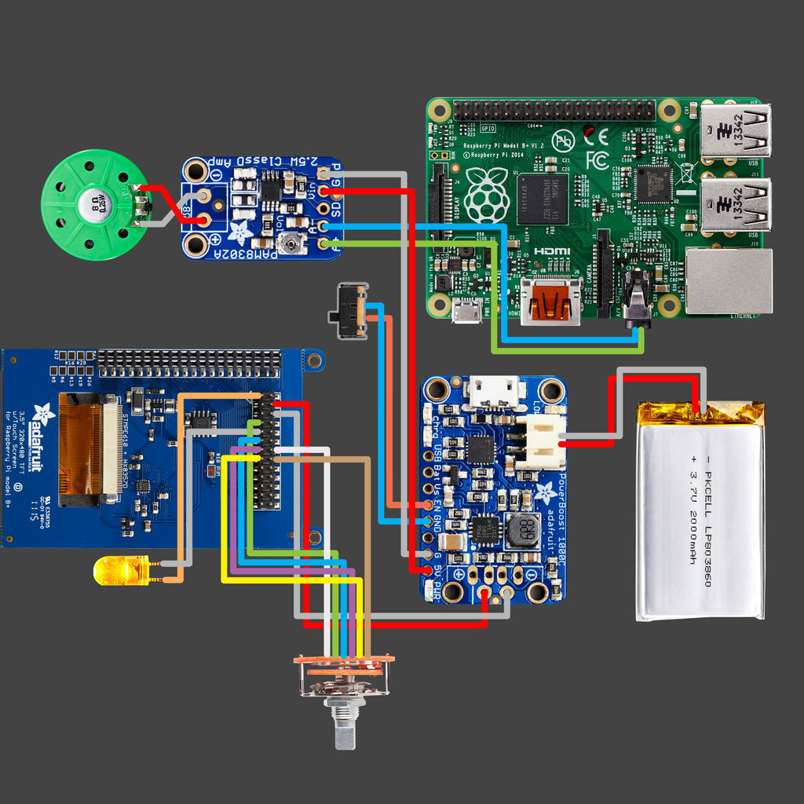
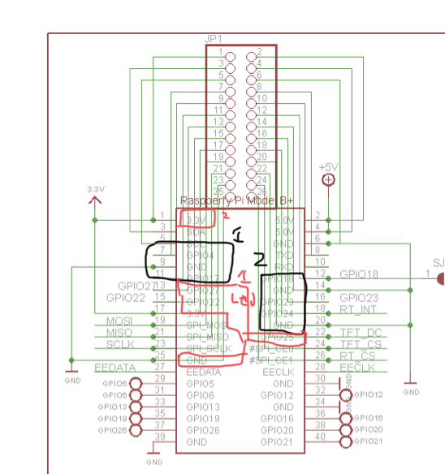
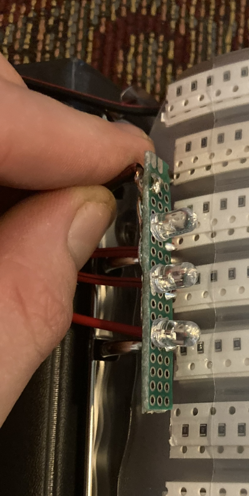

# Pipboy-3000
 Python code recycled and forked to create a UI for a raspi TFT 3.5" using the ytech pipboy 3d model. The touchscreen module is not in production anymore, either find a existing unit or you can change the drivers and some of the 3d model files to accomodate a new touchscreen. 

 # Demonstration
 https://www.reddit.com/r/RASPBERRY_PI_PROJECTS/comments/10emism/pipboy3000_raspberry_pi/?utm_source=share&utm_medium=web2x&context=3
 

Sources:
- Current own version: https://github.com/ColtonMcCasland/pypboy3000

- Credit to sabas1080's code I orignially based my work on: https://github.com/sabas1080/pypboy

- Credit to ytec3d for 3d Model: https://ytec3d.com/pip-boy/

- Wiring diagram: 

- GPIO pinout diagram: https://learn.adafruit.com/raspberry-pi-pipboy-3000/circuit-diagram
  - (*does not include wiring for front three LEDs*)
 
  - Red highlights are LED pins, grey is marked out/ do not use, black are inputs for the rotary switches, and do not use gpio 27 I have marked that out as it messes up the screen input signal, use gpio 18 instead for LEDs, and both rotary switches will just have the two input and one ground pins used, the other ones can act as push buttons but that is not used in any of the code anymore,
    - 
    - **Each** LED needs a 330ohm resistor, I used some cheap PCB and had my friend wired the LEDs and resistors onto to save space.
  
  - Black are Rotary encoder pins
    - The rotary set with three gpio with be the non-scroll wheel button.

- Software installation steps: 
    1. Use image recommended on this link:
        -  https://learn.adafruit.com/adafruit-pitft-3-dot-5-touch-screen-for-raspberry-pi/easy-install-2

    2. Download pygame for Debian:
        - sudo apt-get install python3-pygame

    3. Follow this link and instructions on sdl: https://learn.adafruit.com/adafruit-pitft-3-dot-5-touch-screen-for-raspberry-pi/faq?view=all#ensure-you-are-running-sdl-1-dot-2-2859156

    3. Clone the pip boy git repo in /home/pi/
        git clone https://github.com/ColtonMcCasland/pypboy3000

    4. Follow option 2 in this link to create a script to run the pygame: https://www.makeuseof.com/how-to-run-a-raspberry-pi-program-script-at-startup/

    5. Follow this link and reference the ‘launcher.sh’ file you created. 

    6. Verify it works by running ‘sudo launcher.sh’.
        - This should work and launch the game, if the game errors on missing dependencies, add them. 

    7. Edit  and verify the boot file has dtparam-audio turned on with this command: sudo nano /boot/config.txt
        - Verify this works by running the game with the audio component connected and wired.
